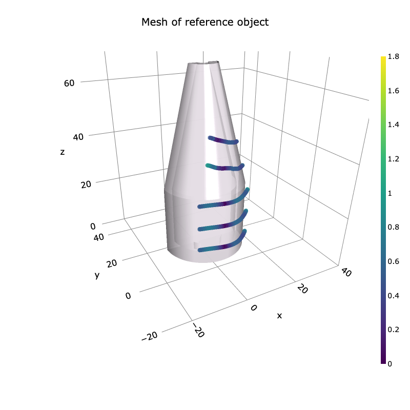
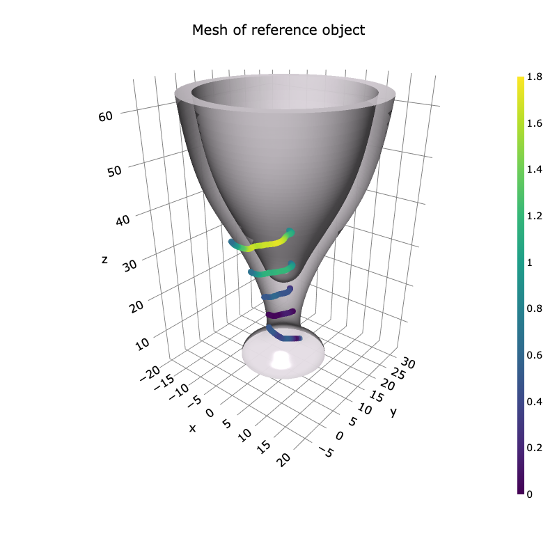
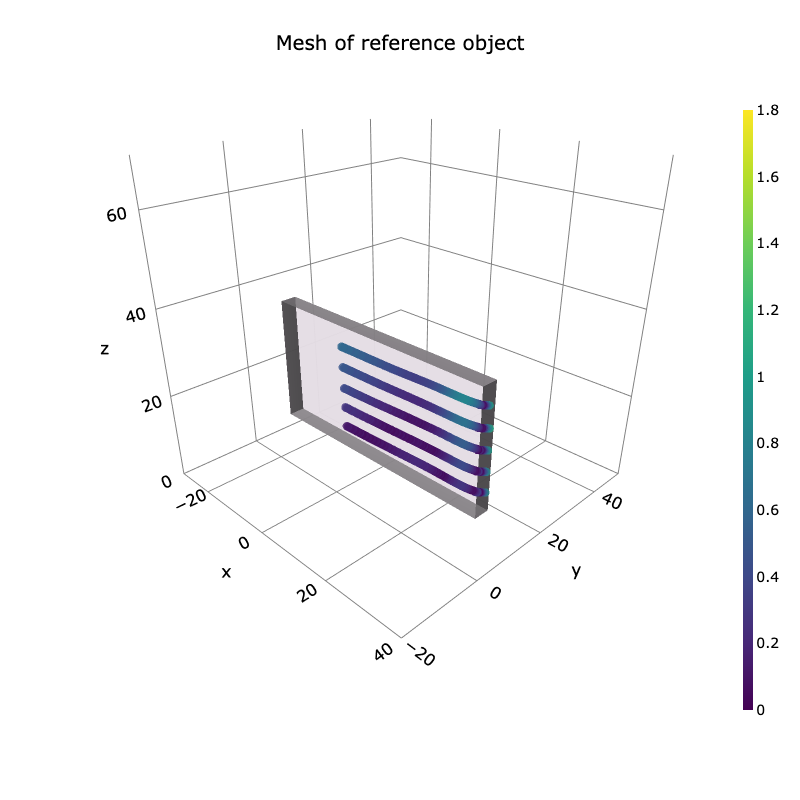
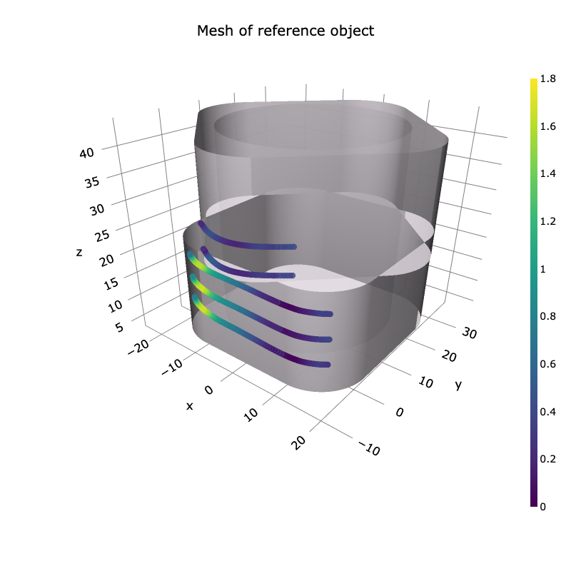

# Navigation and 3D Surface Reconstruction from Passive Whisker Sensing
This repository contains the implementation for the Bayes Filtering methods for contact tracking in [*Navigation and 3D Surface Reconstruction from Passive Whisker Sensing*](https://www.arxiv.org/abs/2406.06038)

 
 
  

# Getting Started
conda create --name research --file requirements.txt

# Installing Gpy (if already build)
python setup.py develop

## ipynb
### ShapeTrackingTutorial.ipynb
A simple example of tracking contact position on an object with initialized sensor model.

### MappingScene.ipynb
Scripts used to process a cluster of contact points and interpolate them using an occupancy map (Bayesian Hilbert Occupancy Maps)

### 3D Object Scan.ipynb
Scripts processes tracking results on 3D printed reference objects to measure the accuracy of tracking in world coordinates. This is used to generate the plot where traces are displayed on top of four objects of different shapes.

### NoiseModel.ipynb
Script used to visualize the different between using a additive noise or multiplicative noise (a.k.a covariance inflation, fading memory filter, adaptive filter)

### Sensor Model Comparison.ipynb
Visualize the sensor models with different kernel functions (RBF, Poly, and ThinPlate), and compare the performance of these models based on sweeping trials on 20/30 mm cylinder object.

### Sensor Model.ipynb
Used to visualize sensor models of different whiskers (semi-curved, curved, straight) and save sensor model data.
